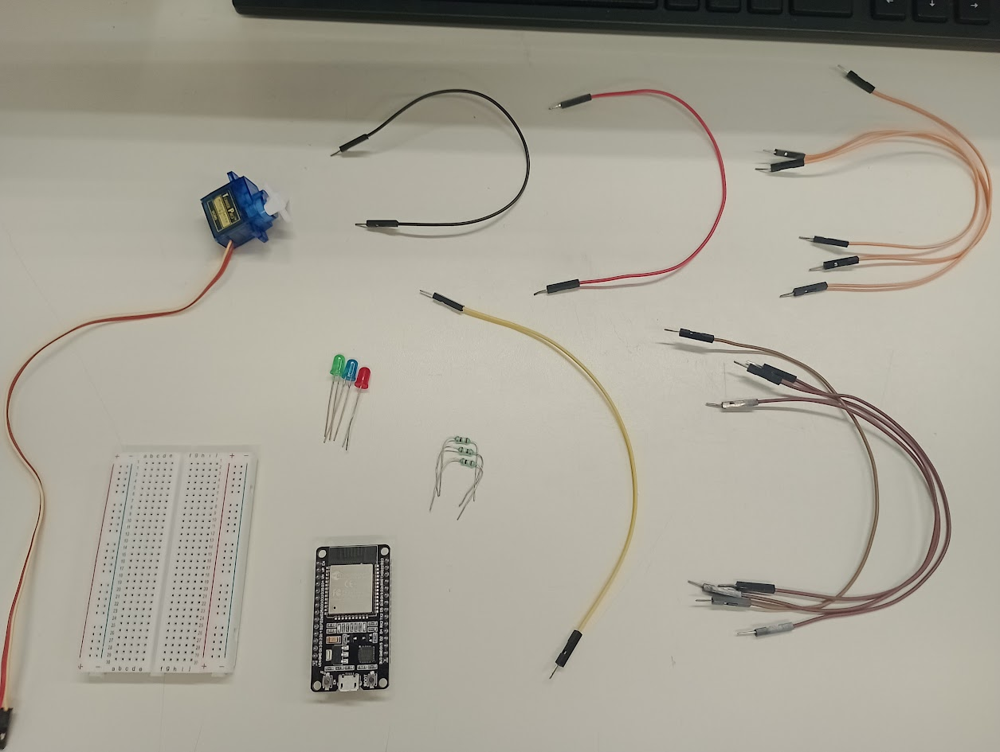
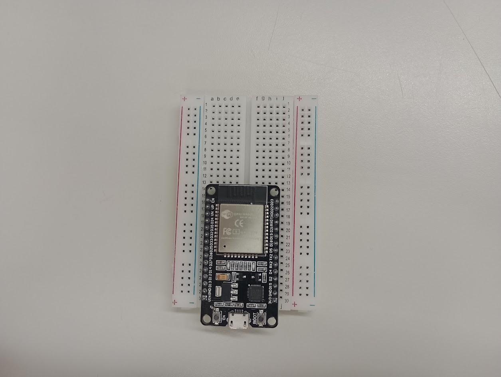
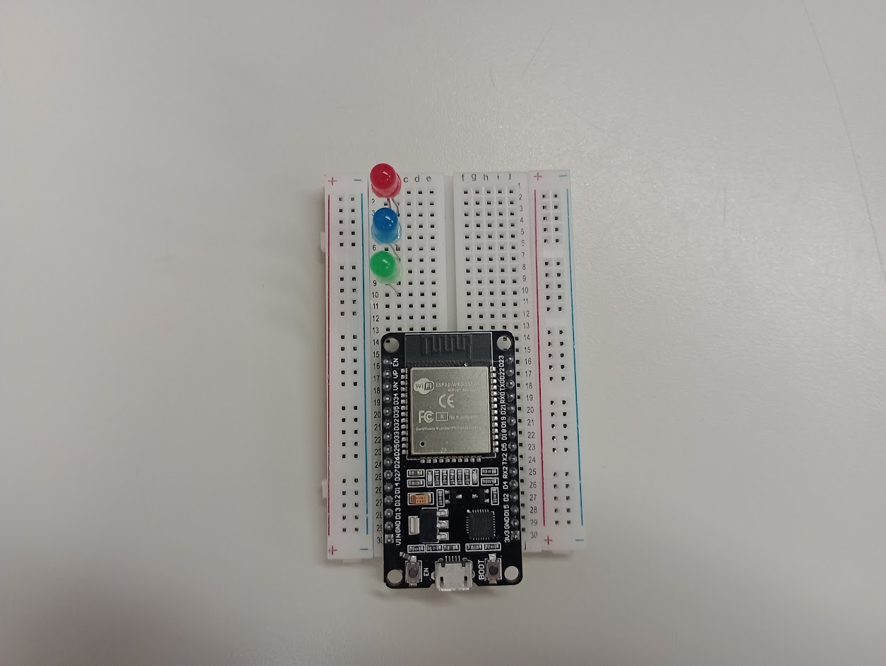
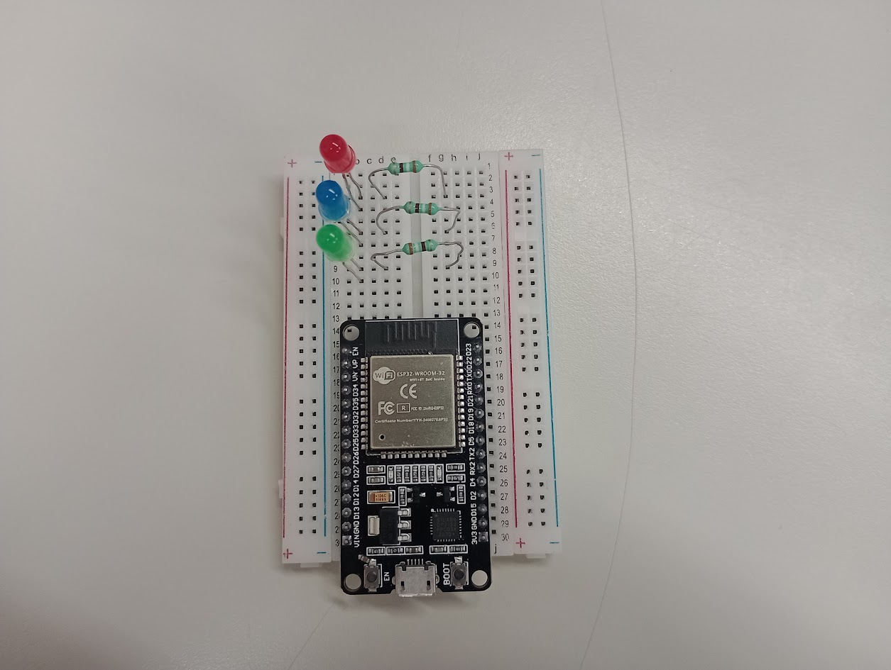
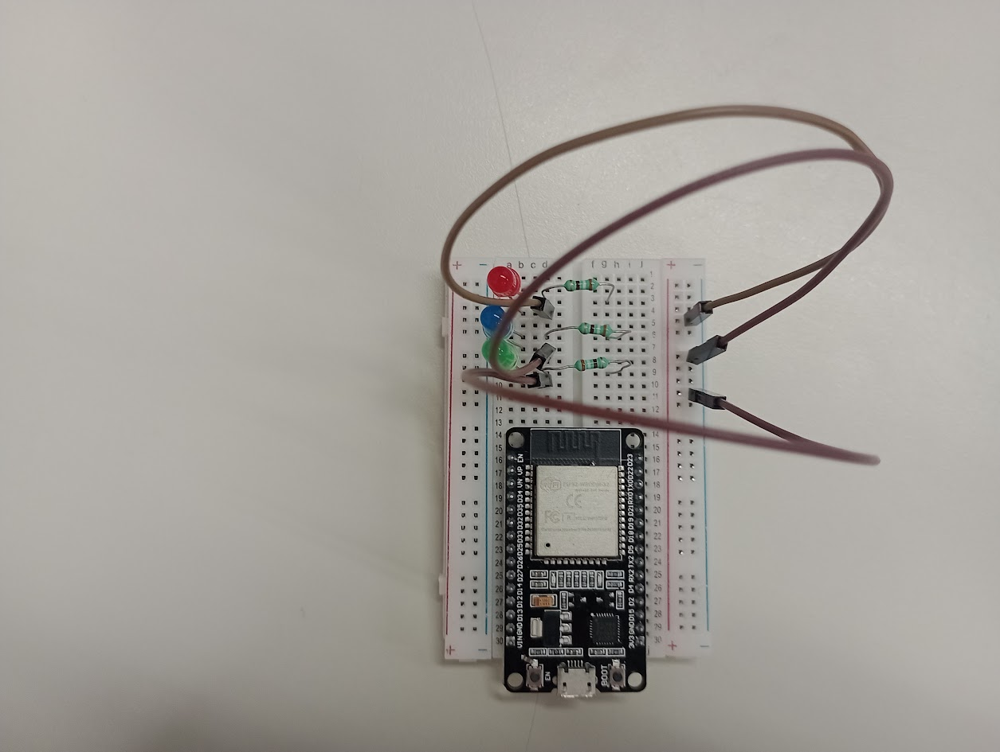
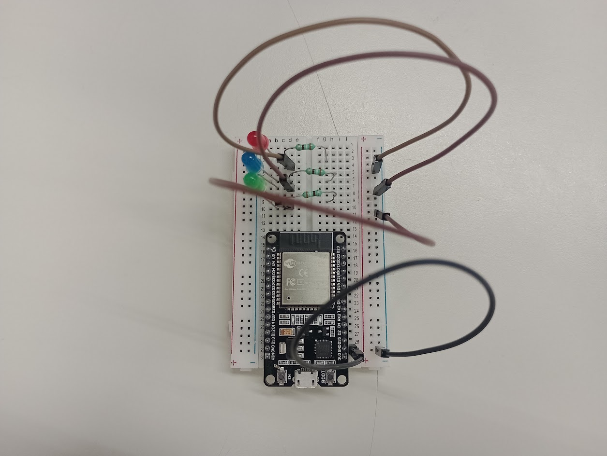
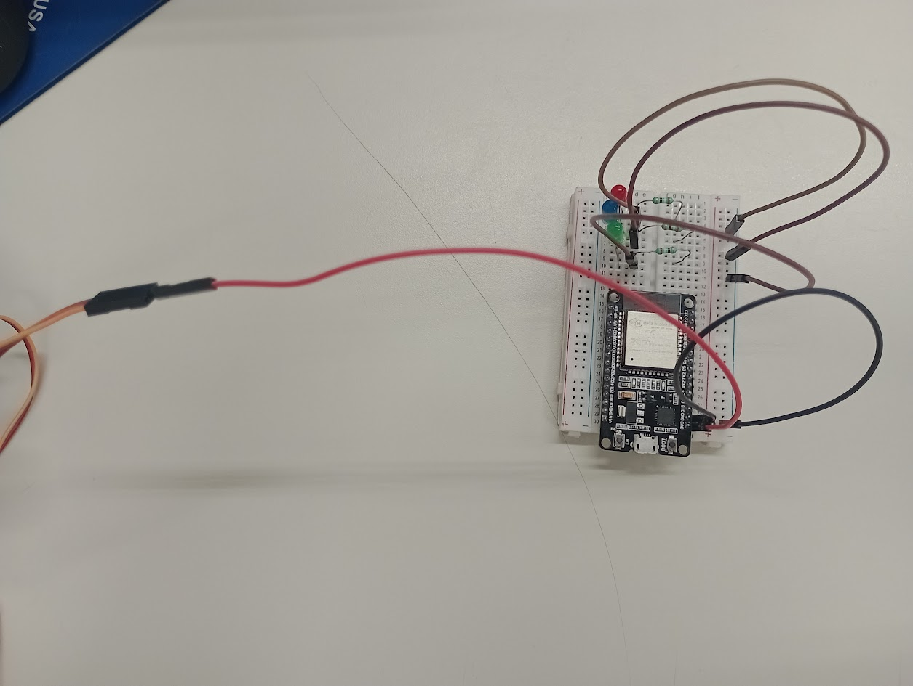
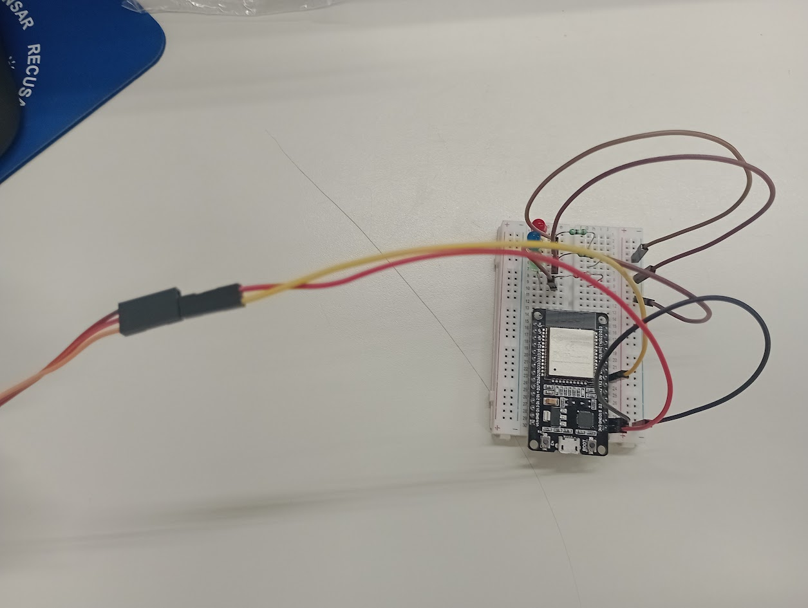
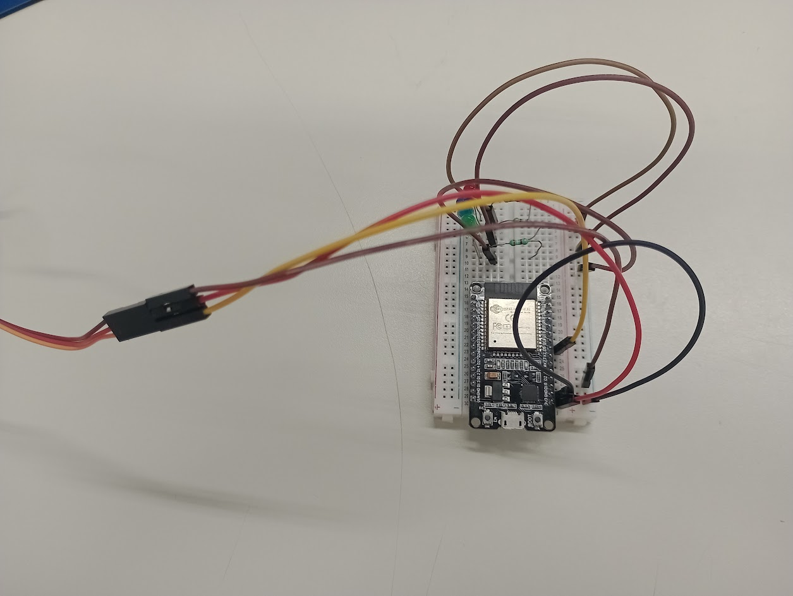
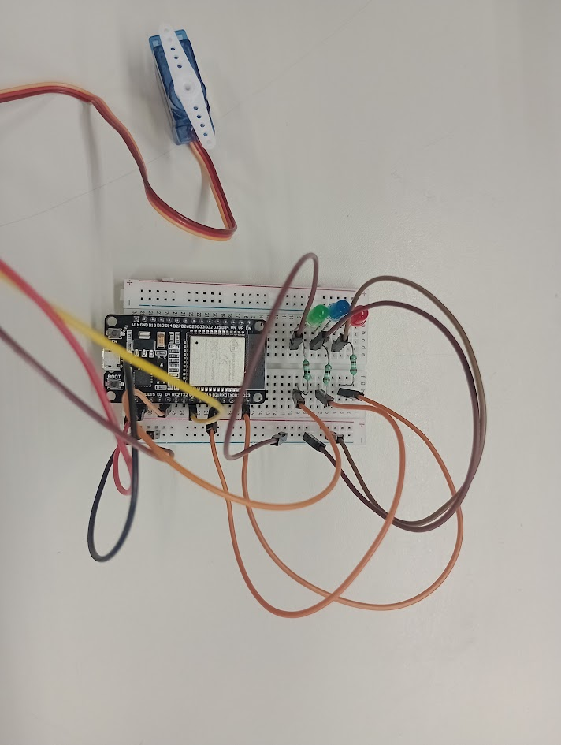

# ServoMotor
Passo a passo para montar um servo motor capaz de acender LEDs.

1º Passo:
Você irá precisar de: 
- 3 cores de LED; 
- 3 resistores verdes;
- 1 ESP32;
- 1 protoboard;
- 1 Servo Motor de 9g;
- 5 fios pretos;
- 1 fio amarelo;
- 4 fios vermelhos;
(No caso do projeto apresentado, foram utilizados 4 fios marrons no lugar dos fios pretos e 3 fios laranjas no lugar dos fios amarelos)

2º Passo:
Na protoboard, encaixe o ESP32;

3º Passo:
Encaixe os 3 LEDs na parte superior da protoboard do lado (a,b,c,d,e);

4º Passo:
Coloque os três resistores com uma das "pernas" em um dos encaixes que ficam ao lado do encaixe da "perna" positiva do LED e a outra "perna" em um dos encaixes da outra divisão (f,g,h,i,j) da protoboard.

5º Passo:
Agora encaixaremos os fios negativos (pretos).
3 dos fios terão uma das pontas colocadas em um dos encaixes que ficam ao lado do LED, ao lado da perna "negativa" do LED.
A outra ponta dos fios já conectados será conectada na parte negativa da placa, no lado (f,g,h,i,j).

6º Passo:
Agora ligaremos o outro fio negativo, um dos lados será colocado no encaixe ao lado da porta GND do ESP e o outro lado ficará na parte negativa da placa, do lado (f,g,h,i,j).

7º Passo:
Agora ligaresmos um dos fios vermelhos, um de seus lados será colocado no encaixe ao lado da porta 3V3 do ESP e o outro lado será conectado no encaixe do fio vermelho no Servo.

8º Passo:
AGora ligaremos o fio amarelo, um de seus lados será colocado no encaixe do lado da porta D5 do ESP e o outro lado será conetado no encaixe do fio laranja no Servo.

9º Passo:
Agora ligaremos o último fio preto, um de seus lados será colocado na parte negativa da placa, do lado (f,g,h,i,j) e o outro lado será conectado no enaixe do fio preto no Servo.

10º Passo:
Agora ligaremos os fios positivos (vermelhos), cado um dos 3 fios restantes terá um lado que será ligado no encaixe que vai ao lado do resistor e o outro lado será ligado nos encaixes ao lado das portas do ESP.
- Fio do LED verde: Ligado na porta D4 do ESP.
- Fio do LED azul: Ligado na porta D21 do ESP.
- Fio de LED vermelho: Ligado na porta D23 do ESP.

11º Passo:
O cabo de alimentação do ESP será encaixado no próprio e no computador.

[🎥 Assista ao vídeo](https://github.com/AnaCavalheri/ServoMotor/raw/main/img/video.mp4)

12º Passo:
Para testar o funcionamento, baixe a biblioteca ESP32Servo e utilize o código de exemplo, modicando no cpodigo apenas a porta do ESP.

--------------
Código de exemplo:

// These constants won't change.  They're used to give names

// to the pins used:

#if defined(ARDUINO_ESP32S2_DEV) || defined(ARDUINO_ESP32S3_DEV)

const int lowestPin = 1;

const int highestPin = 42;

#elif defined(ARDUINO_ESP32C3_DEV)

const int lowestPin = 1;

const int highestPin = 19;

#else

const int lowestPin = 2;

const int highestPin = 33;

#endif

#include <ESP32Servo.h>

Servo myservo;

void setup() {

	Serial.begin(115200);

	// Allow allocation of all timers

	ESP32PWM::allocateTimer(0);

	ESP32PWM::allocateTimer(1);

	ESP32PWM::allocateTimer(2);

	ESP32PWM::allocateTimer(3);

}

void loop() {

	if (!myservo.attached()) {

		myservo.setPeriodHertz(50); // standard 50 hz servo

		myservo.attach(33, 1000, 2000); // Attach the servo after it has been detatched

	}

	myservo.write(0);

	// iterate over the pins:

	for (int thisPin = lowestPin; thisPin <= highestPin; thisPin++) {

		if (ESP32PWM::hasPwm(thisPin) &&  // Is it possible for this pin to PWM

				(ESP32PWM::channelsRemaining() > 0 || // New channels availible to allocate

						pwmFactory(thisPin) != NULL || // already allocated this pin in the factory

						thisPin == 25 || // one of the  2 DAC outputs, no timer needed

						thisPin == 26)) { // one of the 2 DAC outputs, no timer needed

			if (pwmFactory(thisPin) == NULL) { // check if its the first time for the pin or its a DAC

#if defined(ARDUINO_ESP32S2_DEV)

				if (thisPin == 17 || // one of the 2 DAC outputs, no timer needed

						thisPin == 18)

#elif defined(ARDUINO_ESP32C3_DEV) || defined(ARDUINO_ESP32S3_DEV)

				if (1 == 0) //  no DAC outputs for these chips
#else

				if (thisPin == 25 || // one of the 2 DAC outputs, no timer needed

						thisPin == 26)

#endif

				{

					Serial.println("DAC to pin " + String(thisPin));

				} else

					Serial.println("Writing to pin " + String(thisPin));

				pinMode(thisPin, OUTPUT);

			}

			// fade the LED on thisPin from off to brightest:

			for (int brightness = 0; brightness < 255; brightness++) {

				analogWrite(thisPin, brightness);

				delay(1);

				myservo.write(brightness);

			}

			// fade the LED on thisPin from brithstest to off:

			for (int brightness = 255; brightness >= 0; brightness--) {

				analogWrite(thisPin, brightness);

				myservo.write(brightness);

				delay(1);

			}

		}

	}
	myservo.detach(); // Turn the servo off for a while
	
	delay(2000);

}
